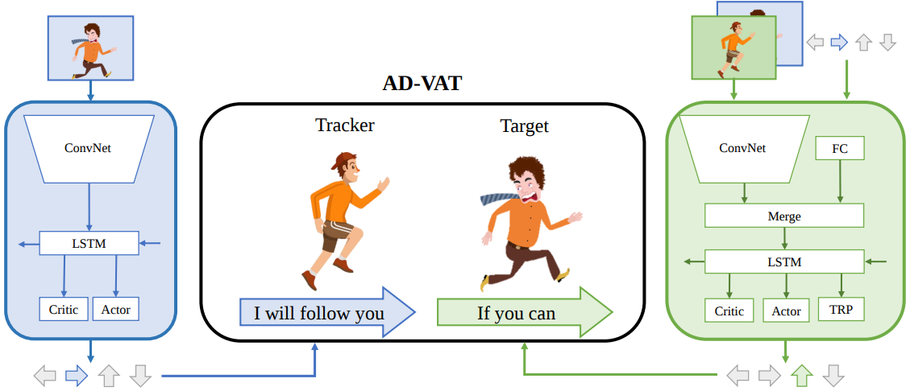
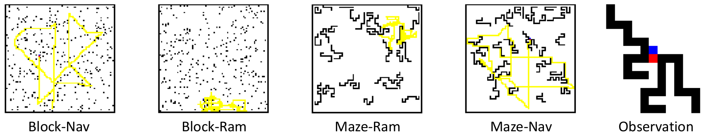
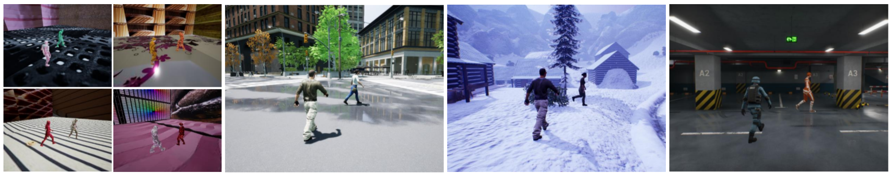

# AD-VAT
This repository is the code for 
[AD-VAT: An Asymmetric Dueling mechanism for learning Visual Active Tracking (ICLR 2019)](https://openreview.net/pdf?id=HkgYmhR9KX). 

It contains the code for training/testing(Pytorch) and the 2D environments.
The 3D environments are hosted in [gym-unrealcv](https://github.com/zfw1226/gym-unrealcv).


# Dependencies
This repository requires:
- Python >= 3.6
- Pytorch >= 1.0
- Opencv >= 3.4
- Numpy == 1.14.0
- setproctitle, scikit-image, imageio, TensorboardX

See [requirements.txt](requirements.txt) for more details.
# Installation
To download the repository and install the requirements, you can run as:
```
git clone https://github.com/zfw1226/active_tracking_rl.git
cd active_tracking_rl
pip install -r requirements.txt
```
**Note that you need install `OpenCV`, `Pytorch`, and `the 2D/3D environments` additionally.**

## Prepare the 2D/3D Environments
We provide various 2D and 3D environments to validate the effectiveness of AD-VAT.


The **2D environment** is a matrix map where obstacles are randomly placed.
The 2D experiment can run on a CPU-only machine.
In the 2D environments, you can evaluate and quantify the effectiveness of AD-VAT in a few minutes. 

To install 2D environments([gym-track2d](/envs/gym-track2d)), you need run:
```
pip install -e envs/gym_track2d
```


The **3D environments** are built on Unreal Engine(UE4), which could be flexibly customized to simulate 
real-world active tracking scenarios.
To run the 3D environments, GPU is necessary.

To install 3D environments, **please follow the instructions in 
[gym-unrealcv](https://github.com/zfw1226/gym-unrealcv).**

# Running on 2D Environments
## Training
You can try AD-VAT in 2D environments by running:
```
python main.py --shared-optimizer --workers 16 --split --train-mode -1 --env Track2D-BlockPartialPZR-v0
```
Note that you need adjust the number of `--workers` according to the number of your cpu cores.
It is important to limit number of worker processes to number of cpu cores available 
as too many processes (e.g. more than one process per cpu core available) will actually be detrimental 
in training speed and effectiveness.
`--split` means that it will save the tracker and target model separately for further evaluation.
Besides, you can also run the two baseline methods referred in the paper.

To train tracker with `Ram` target:
```
python main.py --shared-optimizer --workers 16 --split --train-mode 0 --env Track2D-BlockPartialRam-v0
```
To train tracker with `Nav` target:
```
python main.py --shared-optimizer --workers 16 --split --train-mode 0 --env Track2D-BlockPartialNav-v0
```
To train tracker and target under `Naive dueling`:
```
python main.py --shared-optimizer  --workers 16 --split --network maze-lstm --entropy-target 0.01 --aux none --env Track2D-BlockPartialAdv-v0
```

## Evaluation
You can evaluate the tracker by running:
```
python gym_eval.py --env {ENV_NAME} --network tat-maze-lstm --load-tracker {PATH_TO_YOUR_TRACKER}
```
The ``ENV_NAME`` we used to evaluate in the paper is:
- `Track2D-BlockPartialNav-v0` (Block-Nav),
- `Track2D-BlockPartialRam-v0` (Block-Ram), 
- `Track2D-MazePartialNav-v0` (Maze-Nav).
- `Track2D-MazePartialRam-v0` (Maze-Ram), 

If you use the the default setting while training, the `PATH_TO_YOUR_MODLE` should be `logs/{ENV_NAME}/{DATE}/tracker-best.dat`


You can also evaluate the effectiveness of the `tracker-aware target` by running with different trackers, as:
```
python gym_eval.py --env Track2D-BlockPartialAdv-v0 --network tat-maze-lstm --load-tracker {PATH_TO_YOUR_TRACKER} --load-target {PATH_TO_YOUR_TARGET}
```

# Running on 3D Environments
## Training
You can try AD-VAT in 3D environments by running:
```
python main.py --shared-optimizer  --workers 6  --split --network tat-cnn-lstm --rnn-out 256 --entropy-target 0.05 --sleep-time 30 --env UnrealTrack-DuelingRoomPZR-DiscreteColor-v4 --env-base UnrealTrack-DuelingRoomNav-DiscreteColor-v4 --gray --rescale --lr 0.0001
```
To train the baselines, you only need reset `--env` to `UnrealTrack-DuelingRoomRam-DiscreteColor-v4` or `UnrealTrack-DuelingRoomNav-DiscreteColor-v4`, and set `--train-mode` to `0` meanwhile.

## Evaluation
You can evaluate the tracker by running:
```
python gym_eval.py --env {ENV_NAME} --network cnn-lstm --gray --rescale --rnn-out 256 --load-tracker {PATH_TO_YOUR_TRACKER} 
```
The ``ENV_NAME`` we used to evaluate in the paper is: 
- `UnrealTrack-DuelingRoomNav-DiscreteColor-v4` (DR Room), 
- `UnrealTrack-UrbanCityNav-DiscreteColor-v1` (Urban City), 
- `UnrealTrack-SnowForestNav-DiscreteColor-v1` (Snow Village),
- `UnrealTrack-GarageNav-DiscreteColor-v0` (Parking Lot)

# Visualization
You could monitor the performance while training using `tensorboard`:
```
tensorboard --logdir {PATH_TO_LOGS}
```
If you use the the default setting while training, `PATH_TO_LOGS` should be `logs/{ENV_NAME}/{DATE}`


# Citation
If you found AD-VAT useful, please consider citing:
```
@inproceedings{zhong2018advat,
  title={{AD}-{VAT}: An Asymmetric Dueling mechanism for learning Visual Active Tracking},
  author={Fangwei Zhong and Peng Sun and Wenhan Luo and Tingyun Yan and Yizhou Wang},
  booktitle={International Conference on Learning Representations},
  year={2019},
  url={https://openreview.net/forum?id=HkgYmhR9KX},
  }
```

# Contact
If you have any suggestion/questions, get in touch at [zfw@pku.edu.cn](zfw@pku.edu.cn).