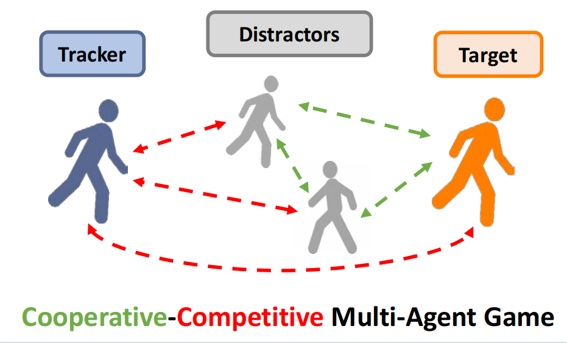
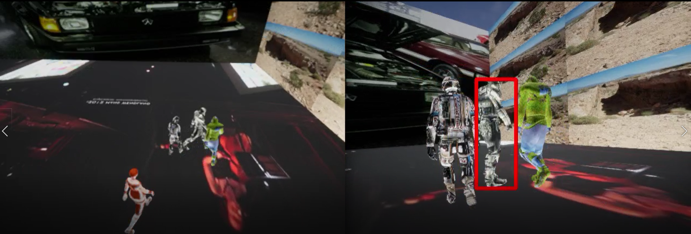
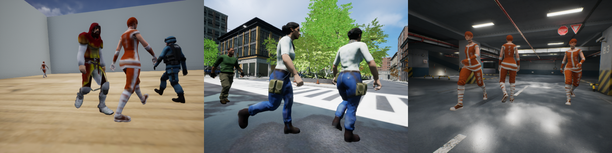
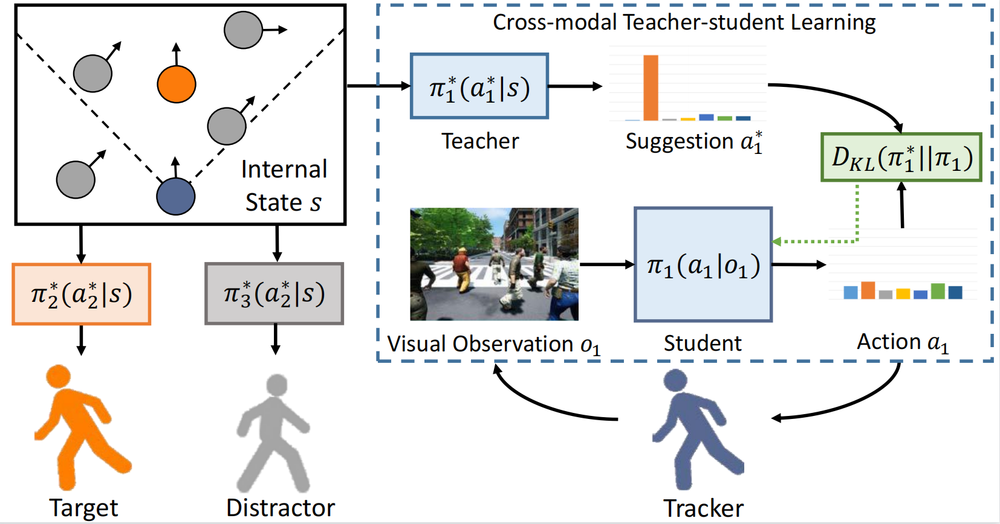

# Towards Distraction-Robust Active Visual Tracking
This repository is the code for 
[Towards Distraction-Robust Active Visual Tracking (ICML 2021)](https://icml.cc/Conferences/2021/ScheduleMultitrack?event=8904). 

It contains the code for training/testing (Pytorch).
The 3D environments are hosted in [gym-unrealcv](https://github.com/zfw1226/gym-unrealcv).


# Dependencies
This repository requires:
- Python >= 3.6
- Pytorch >= 1.2
- Opencv >= 3.4
- Numpy == 1.14.0
- setproctitle, scikit-image, imageio, TensorboardX

See [requirements.txt](requirements.txt) for more details.
# Installation
To download the repository and install the requirements, you can run as:
```
git clone https://github.com/zfw1226/active_tracking_rl.git -b distractor
cd active_tracking_rl
pip install -r requirements.txt
```
**Note that you need install `OpenCV`, `Pytorch`, and `the 3D environments` additionally.**

## Prepare the 3D Environments
We provide a room with environment augmentation for training. 


Three high-fidelity environments (SimpleRoom, UrbanCity, ParkingLot) are used for testing.


These **3D environments** are built on Unreal Engine (UE4), which could be flexibly customized to simulate  real-world active tracking scenarios.
To run the 3D environments, GPU is necessary.

To install 3D environments, **please follow the instructions in 
[gym-unrealcv](https://github.com/zfw1226/gym-unrealcv).**

# Training
### Step 1: Learning Meta Policies and Building Multi-Agent Curriculum.
```
python main.py --model simple-pos-act-lstm --tracker none --env UnrealTrackMulti-FlexibleRoomAdv-DiscreteColor-v1 --env-base UnrealTrackMulti-FlexibleRoomAdv-DiscreteColor-v1 --rnn-out 128 --seed 4 --seed-test 2 --train-mode -1 --test-eps 25 --norm-reward --aux reward --lr 0.001 --gpu-id 0
```
After that, move the saved models (*.pth) in the log folder to an empty folder, as a model pool. 
Then finetune the meta tracker (teacher) by running:
```
python main.py --model simple-pos-act-lstm --tracker none --env UnrealTrackMulti-FlexibleRoomAdv-DiscreteColor-v1 --env-base UnrealTrackMulti-FlexibleRoomAdv-DiscreteColor-v1 --rnn-out 128 --seed 4 --seed-test 2   --train-mode 0 --norm-reward --aux attack-reward --lr 0.0005 --gpu-id 1 --old {PATH TO MODEL POOL} --load-model-dir {PATH TO NEWEST MODEL}
```
### Step 2: Learning Visual Tracker (Cross-modal Teacher-student Learning).
```
python main.py --model pos-act-lstm-novision --tracker tiny-ConvLSTM-att-lstm-layer --env UnrealTrackMulti-FlexibleRoomAdv-DiscreteColor-v3 --env-base UnrealTrackMulti-FlexibleRoomNav-DiscreteColor-v1 --seed 2 --seed-test 4 --rnn-out 256 --train-mode 6 --aux teacher  --test-eps 50 --early-done --mem buff --buffer-size 500 --batch-size 8 --rescale --inv --flip --lr 0.0001 --fix --num-steps 30 --gpu 1 --gpu-ids 1 --load-teacher {PATH TO META POLICY} --old {PATH TO MODEL POOL} 
```

## Evaluation
You can evaluate the tracker by running:
```
python gym_eval.py --model pos-act-lstm-none --tracker tiny-ConvLSTM-att-lstm-layer --env {ENV_NAME} --seed {NUM_DISTRACTOR} --rnn-out 256 --gpu-id 0 --pytrack none --num-episodes 100 --load-tracker {PATH_TO_YOUR_TRACKER} --early-done --rescale
```
The ``ENV_NAME`` we used to evaluate in the paper is: 
- `UnrealTrackMulti-FlexibleRoomNav-DiscreteColor-v1` (Simple Room), 
- `UnrealTrackMulti-UrbanCityNav-DiscreteColor-v1` (Urban City), 
- `UnrealTrackMulti-GarageNav-DiscreteColor-v0` (Parking Lot)

# Visualization
You could monitor the performance while training using `tensorboard`:
```
tensorboard --logdir {PATH_TO_LOGS}
```
If you use the the default setting while training, `PATH_TO_LOGS` should be `logs/{ENV_NAME}/{DATE}`

# Citation
If you found AD-VAT useful, please consider citing:
```
@inproceedings{zhong2021distraction,
title={Towards Distraction-robust Active Visual Tracking},
author={Fangwei Zhong and Peng Sun and Wenhan Luo and Tingyun Yan and Yizhou Wang},
booktitle={International Conference on Machine Learning},
year={2021}
}
```

# Contact
If you have any suggestion/questions, get in touch at [zfw@pku.edu.cn](zfw@pku.edu.cn).